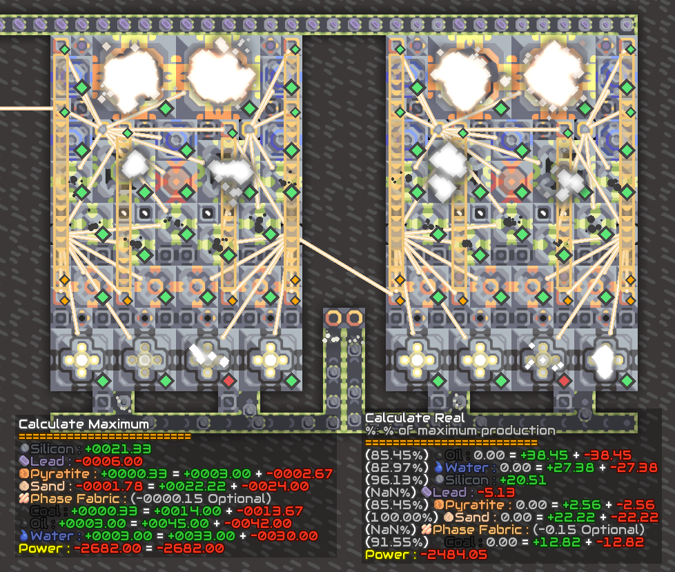

  
*A V6 Version of this mod can be found [here](https://github.com/L0615T1C5-216AC-9437/MaxRateCalculatorV6).*

# Max Rate Calculator
A mindustry mod that allows you to calculate the efficiency, bottle neck and ratios of your machinations.  
*may or may not work with modded items / blocks*

## Installation Guide

In-Game Installation
1. Open mindustry, go to `mods` section
2. Select `Browse Mods`
3. Search for `Max Rate Calculator`
4. Download and **Enable** the mod

Manual Installation  
1. Download the latest mod verion in [#Releases](https://github.com/L0615T1C5-216AC-9437/MaxRateCalculator/releases).
2. Open mindustry, go to `mods` section, select `Open Folder`
3. Move the mod (`Jar` file) into the folder
4. Reopen mindustry.
   If you get a welcome message, the mod was successfully installed

## Usage
The Max Rate is ran by selecting the are you want the mrc[1] to calculate. This is done by pressing the \[ ` ~ ] button in your keyboard and selecting a area as if you were making a schematic.
1. Press \[ ` ~ ] in your keyboard
2. Move your mouse
3. Select what type of calculation you want (Max Rate, Real Rate, etc.)
4. Profit.

## Building Your own .Jar

1. Install JDK 16. If you don't know how, look it up.
2. Open CMD/Terminal to the plugin directory. The one were the gradle.bat file is located
3. Type and Run `gradlew jar` [2].
4. Your mod jar will be in the `build/libs` directory.

## Android?
no.

## Supported Languages
English (en)  
Spanish (es)  
*This mod will automatically switch language if a Language Pack is available.*

## Need Help?
If you have any questions on how to run / build / use this mod you can contact me through discord.  
Discord: `L0615T1C4L.N16HTM4R3#6238` ( I respond to DM's)  
Discord-Server: https://discord.gg/e5t2672rm2

--- 
*[1]* *Acronym for Max Rate Calculator*  
*[2]* *On Linux/Mac it's `./gradlew`, If the terminal returns Permission denied or Command not found run `chmod +x ./gradlew`*
